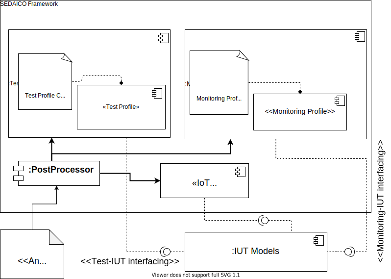

# SEDAICO Framework

[](https://github.com/rdsea/) 

> Note: We are currently revising the prototype and the code will be released soon


SEDAICO (Security Elasticity Dependency Analysis In Computing cOntinuum) framework aids the developers in establishing concrete security-elasticity dependency analytics for the IIoT platform services.

## Components and code structure
The Sedaico framework has the following components and the code has been structured in the same order:



## Using the framework:

### Softwares required:
* Docker and Docker compose: See: https://docker.com

### Steps:


---

### References 
Rohit Raj, Hong-Ling Truong, "On Analysis of Security and Elasticity Dependency in IIoT Platform Services", _The 2021 IEEE International Conference on Services Computing (SCC)_, (to appear).

### Citing
If you use this repository or the paper, please cite as:

```
Rohit Raj, Hong-Ling Truong, "On Analysis of Security and Elasticity Dependency in IIoT Platform Services", _2021 IEEE International Conference on Services Computing (SCC)_, (to appear), 2021.
```

or BibTeX entry

```
@inproceedings{sedaico2021,
author = {Raj, Rohit and Truong, Hong-Linh},
journal = {2021 IEEE International Conference on Services Computing (SCC)},
pages = {to appear},
volume={},
number={},
title = {On Analysis of Security and Elasticity Dependency in IIoT Platform Services},
year = {2021}
}
``` 